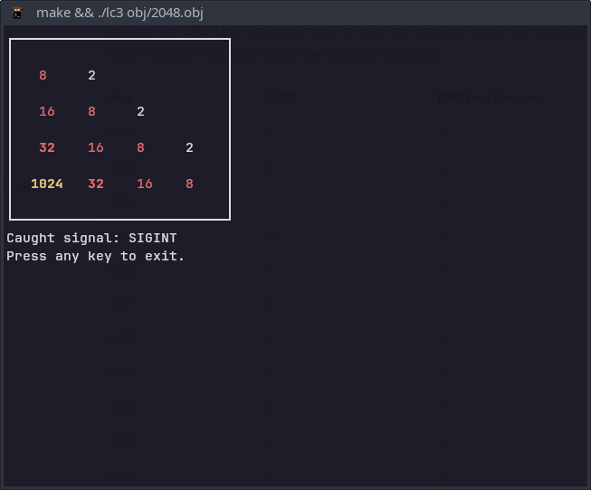

# LC-3 VM in Go

An LC-3 VM implementation as described at https://www.jmeiners.com/lc3-vm.

## Features

Besides the obvious (running LC-3 programs):

- uses alternate buffer to preserve terminal state;
- hides cursor for a more immersive gaming experience :-)
- graceful shutdown by capturing `Ctrl-C`;
- partial integration testing by running 10 x 1KB, automatically generated images
  (using random combinations of `ADD`, `AND`, `LD`, `LDR`, `NOT`, `LDI` and `LEA` opcodes) and
  verifying the `CPU` registers at the end (**TODO**: verify memory too);
- loading images at the address specified in the object file, NOT hardcoding PC to
  `0x3000`.

And just for the fun, since I control the VM anyway ¯\\\_(ツ)\_/¯ a bit of _hacking_:

- allow using arrow keys for input (convert them transparently to `WASM`);
- output nicer box for 2048 using [DEC Line Drawing](https://learn.microsoft.com/en-us/windows/console/console-virtual-terminal-sequences#designate-character-set).

## Useful

### Resources:

- https://www.jmeiners.com/lc3-vm/
- https://www.jmeiners.com/lc3-vm/supplies/lc3-isa.pdf
- https://students.cs.byu.edu/~cs345ta/labs/P4-Virtual%20Memory.html
- https://en.wikipedia.org/wiki/Little_Computer_3
- https://www.andreinc.net/2021/12/01/writing-a-simple-vm-in-less-than-125-lines-of-c

### Tools:

- https://wchargin.com/lc3web/
- https://www.exploringbinary.com/twos-complement-converter/
